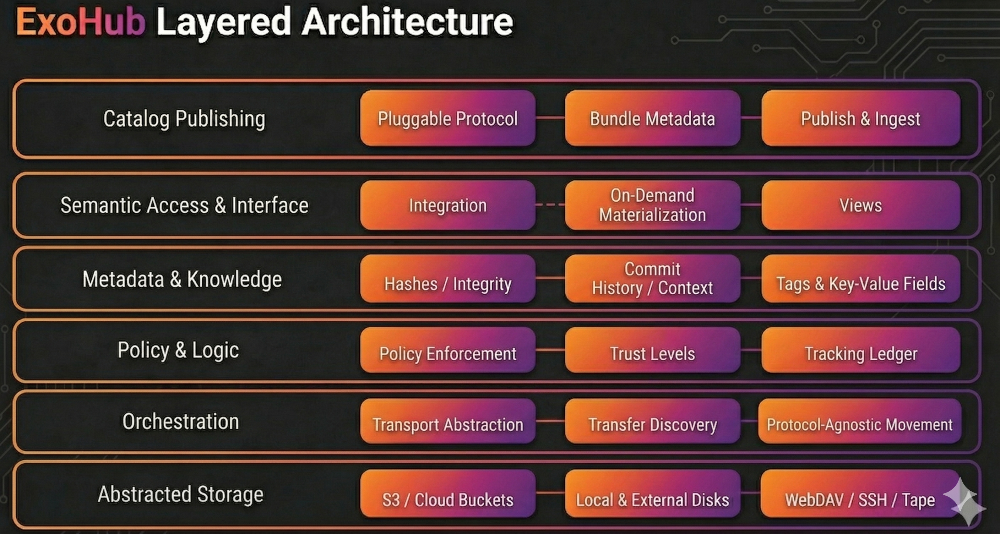

## ExoHub Architecture Report: The Layered Data Management Solution

This page provides a comprehensive breakdown of the **ExoHub Layered Architecture**, a sophisticated data management solution built upon `git-annex`. This "layered cake" model illustrates how ExoHub transitions from raw, heterogeneous storage into a refined, semantic interface for end-users.

### Layer 1: Abstracted Storage ("Foundation")
This represents the physical or virtual hardware where the bits actually reside. ExoHub treats all storage as a commodity.

#### S3 / Cloud Buckets
High-scale object storage for durability.
* **How it works:** ExoHub uses "Special Remotes" to talk to S3 APIs. In Annex mode, the bucket acts as a massive key-value store for hashes.
* **Key benefit:** Provides virtually infinite scale and geographic redundancy.

#### Local & External Disks
Physical hardware under direct control.
* **How it works:** ExoHub tracks the UUID of disks. When a drive is plugged in, the system recognizes it and can begin syncing based on policy.
* **Key benefit:** Extremely low-latency access and the ability to work in "air-gapped" or offline environments.

#### WebDAV / SSH / Tape / Google Drive
Legacy and specialized network storage.
* **How it works:** The system uses hooks to interface with traditional servers or cold-storage systems.
* **Key benefit:** Maximizes ROI on existing infrastructure by bringing "siloed" data into the unified ExoHub ecosystem, Google Drive with "Export Mode"" to sharing files (PDF, HTML reports, etc...) to non-technical users.

### Layer 2: Orchestration ("Engine")
This layer handles the logistics of data movement, abstracting away the specifics of network protocols and storage types.

#### Transport Abstraction
A unified communication layer for all storage.
* **How it works:** It translates high-level commands into protocol-specific actions (e.g., `S3 PUT`, `SCP`, or `RSYNC`).
* **Key benefit:** Users interact with a single interface, regardless of the backend storage type.

#### Transfer Discovery
The path-finding intelligence of ExoHub.
* **How it works:** When data is requested, the engine "discovers" which remotes are currently reachable and calculates the most efficient (fastest or cheapest) path to retrieve the bits.
* **Key benefit:** Minimizes latency and egress costs by automatically preferring local or high-speed sources.

#### Materialization Logic (Annex vs. Export)
The decision engine for how data is formatted on the destination.
* **How it works:** It manages two distinct modes of storage:
    1.  **Annex Mode (Hash-based):** Files are stored as content hashes. Ideal for internal integrity and deduplication.
    2.  **Export Mode (Tree-based):** Files are "materialized" with their original filenames and directory structure.
* **Example:** A "Backup" remote uses Annex mode for safety, while a "Public Share" remote uses Export mode so non-ExoHub users can read the files.
* **Key benefit:** Balances technical rigor (hashes) with practical accessibility (names).

### Layer 3: Policy & Logic ("Controller")
This is the governance engine of ExoHub, ensuring that organizational requirements for data safety and redundancy are met automatically.

#### Policy Enforcement
The ruleset that dictates the "life" of a file.
* **How it works:** Administrators define policies like `numcopies=3`. The system monitors the network and warns (or triggers transfers) if a file drops below this redundancy threshold.
* **Key benefit:** Guarantees data durability and compliance without requiring users to remember to "make a backup."

#### Trust Levels
The reliability assessment of the infrastructure.
* **How it works:** Remotes are categorized as `trusted` (highly available), `semi-trusted`, or `untrusted` (temporary/local).
* **Key benefit:** Allows the system to safely manage the deletion of local copies, knowing that a "trusted" copy exists elsewhere.

#### Tracking Ledger
The global map of the data universe.
* **How it works:** A specialized, hidden Git branch records the movement of every file hash. It acts as a real-time ledger of which drive, bucket, or server currently holds which pieces of data.
* **Key benefit:** Provides instant visibility into data location even when storage remotes are offline.

### Layer 4: Metadata & Knowledge ("Brain")
This layer manages the "source of truth" regarding what the data is and where it came from. It merges technical certainty with human context.

#### Hashes / Integrity
The cryptographic identity of every file.
* **How it works:** Every file is assigned a unique hash (e.g., SHA256). ExoHub periodically runs integrity checks (`fsck`) to ensure the bits on a remote still match the original hash.
* **Key benefit:** Provides an absolute guarantee against "bit rot" and silent data corruption across all storage remotes.

#### Commit History / Context
The chronological narrative of the dataset.
* **How it works:** By leveraging the Git commit graph, every change to the data is associated with a user, a timestamp, and a commit message.
* **Key benefit:** Creates a permanent audit trail, answering the "who, when, and why" for every modification.

#### Tags & Key-Value Fields
User-defined semantic descriptors.
* **How it works:** Users attach arbitrary metadata (e.g., `confidence=high`) directly to files. These tags are stored in the git-annex branch and synchronized globally.
* **Key benefit:** Transforms "dead files" into a searchable knowledge base.

### Layer 5: Semantic Access & Interface ("Lens")
This is the primary interface for users and automated pipelines. Its goal is to provide a clean, high-level view of the data that hides the underlying complexity of storage and retrieval protocols.

#### Integration
The entry point where ExoHub meets the user's local workspace.
* **How it works:** It uses Git's pointer system to represent files in the repository. Even if the data isn't locally present, the file "exists" as a pointer that ExoHub understands.
* **Key benefit:** Provides a unified, consistent entry point for all organizational data.

#### On-Demand Materialization
The mechanism that fetches data only when it is needed.
* **How it works:** When a user attempts to open or "get" a file, the system identifies the file's hash, locates it across the network, and downloads it into the local workspace.
* **Key benefit:** Massive datasets can be managed on devices with limited storage, as only the "working set" of data is ever locally materialized.

#### Views (Virtual Filesystem)
Dynamic navigation of the repository based on metadata rather than a static folder hierarchy.
* **How it works:** It uses the `git annex view` engine to transform metadata tags into a temporary directory structure.
* **Example:** A user can instantly "pivot" their view from `/year/project/file` to `/tag/status/file` without moving any data on the disk.
* **Key benefit:** Enables multi-dimensional discovery, allowing different teams to navigate the same data according to their specific needs.

### Layer 6: Catalog Publishing ("Bridge")
This layer connects ExoHub's data-as-code ecosystem to external **data catalogs** — systems that make datasets findable, searchable, and accessible to the broader organization. It bridges the gap between versioned data repositories and discovery platforms.

#### Pluggable Catalog Protocol
A binary-based integration model for external catalogs.
* **How it works:** A new category of remote (`type: artifactdb`, or any custom type) with a `mode` field (`export` or `import`) delegates publishing to an external binary (`git-annex-remote-<type>-<mode>`) that handles S3 upload, metadata packaging, and catalog notification. The `exo` CLI contains no catalog-specific logic.
* **Key benefit:** Anyone can integrate a new catalog by implementing a single binary — no changes to the CLI needed.

#### Bundle Metadata
Structured JSON artifacts generated by `exo bundle` that describe a repository at a specific revision.
* **How it works:** The bundle includes per-file metadata (path, size, storage locations), per-commit history (author, date, message), and a manifest. This metadata is the input for catalog indexing.
* **Key benefit:** Catalogs receive a complete, self-contained snapshot of the dataset's structure and history, without needing access to the git repository itself.

#### Publish & Ingest
The automated pipeline from repository to catalog index.
* **How it works:** `exo sync --with <catalog-remote>` uploads bundle metadata to S3, then notifies the catalog API. The catalog reads the metadata from S3 and indexes it asynchronously. Permissions from `.exohub/permissions` are propagated to control access in the catalog.
* **Key benefit:** Publishing is a single command that integrates into existing sync workflows. Release-only publishing (`publish_on: tag`) ensures only tagged versions are indexed.

See [Catalog Publishing](catalog-publishing/) for the full architectural details and ArtifactDB/ integration.
