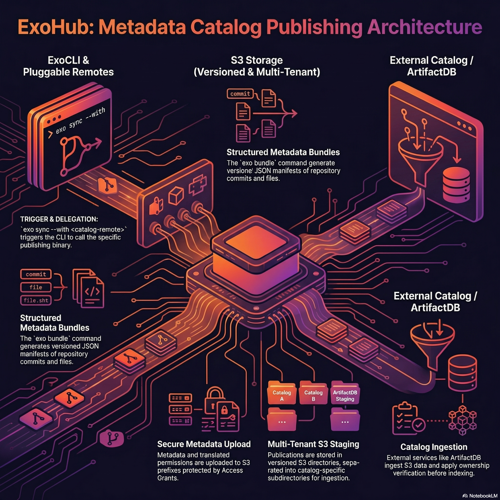

## Overview

ExoHub can publish structured metadata from data repositories to external **catalog systems** for indexing, search, and discovery. This bridges the gap between data-as-code (git + git-annex) and data catalogs that make datasets findable and accessible.

The architecture is **pluggable** — different catalog systems can be integrated by implementing a simple binary protocol, without modifying the `exo` CLI itself.



## Concepts

### Catalog Remotes

A **catalog remote** is a new category of remote in `.exohub/remotes` that targets a metadata catalog instead of a storage backend. Unlike `annex`, `export`, `import`, or `exospace` remotes that manage data files on S3 or local storage, catalog remotes publish metadata to indexing services.

```yaml
# .exohub/remotes
remotes:
  - name: s3-annex
    type: annex
    s3url: s3://bucket/dataset/_annex

  - name: my-catalog
    type: artifactdb                    # ← catalog remote
    mode: export                        # required: determines binary (git-annex-remote-artifactdb-export)
    s3url: s3://bucket/dataset/_catalog
    instance_url: 
    grants: true
    publish_on: tag
```

The `type` and `mode` fields together determine which binary handles the publishing. For `type: artifactdb` with `mode: export`, the CLI delegates to `git-annex-remote-artifactdb-export`. A future `mode: import` would use `git-annex-remote-artifactdb-import`.

### The Publish Flow

Publishing is triggered by `exo sync --with <catalog-remote>` and follows this chain:

```
exo sync --with my-catalog
  │
  └→ git-annex-remote-artifactdb-export publish
       │
       ├─ 📊 Read bundle metadata from .exohub/bundles/<ref>/
       ├─ ☁️  Upload to S3 (s3url/<ref_name>/)
       │     ├─ .exohub-bundle/    (generic metadata: bundle.json, commits/, files/)
       │     └─ .artifactdb/       (business metadata, if present)
       ├─ 🔒 Upload permissions.json
       ├─ 📡 Notify ExoHub API (POST /api/publish)
       │     │
       │     └→ ExoHub forwards to catalog targets:
       │          ├─ Default: /exohub tenant (generic metadata)
       │          └─ instance_url tenant (business metadata)
       │
       └─ ⚙️  Catalog triggers IngestWorkflow
              ├─ Read metadata from S3
              ├─ Index into search engine
              └─ Store pointer for re-indexing
```

### Pluggable Protocol

The `exo` CLI doesn't contain any catalog-specific logic. Instead, it discovers a binary matching the remote type:

```
git-annex-remote-<type>-<mode>
```

The CLI calls this binary with a `publish` subcommand, passing configuration from `.exohub/remotes` as flags:

```bash
git-annex-remote-artifactdb-export publish \
  --s3url <s3url> \
  --bundle-dir .exohub/bundles/v1.0/ \
  --artifactdb-dir .artifactdb \
  --grants \
  --api-url /api
```

Anyone can create a new catalog integration by implementing a binary with this interface. See the [Catalog Remote Protocol](/specs/catalog-remote-protocol) for the full specification.

### Bundle Metadata

The `exo bundle` command generates structured JSON metadata describing a repository at a specific git revision:

- **`bundle.json`** — manifest with repo URL, ref, file counts, generation time
- **`commits/*.json`** — per-commit metadata (author, date, message, modified files)
- **`files/*.json`** — per-file metadata (path, size, annex key, storage locations)

This metadata is the input for catalog indexing. It lives in `.exohub/bundles/<ref>/` and is git-annex tracked so it can be synced like any other data.

### S3 Layout

Each publication creates a versioned directory on S3, with catalog-specific subdirectories:

```
s3://bucket/dataset/_catalog/
  v1.0/
    .exohub-bundle/              → generic bundle metadata
      bundle.json
      commits/
      files/
    .artifactdb/                 → business metadata (if any)
      dataset.json
    permissions.json              → access control
  v1.1/
    ...
```

This separation allows multiple catalog systems to feed from the same S3 location, each reading only the subdirectory relevant to them.

### Permissions

Permissions from `.exohub/permissions` are translated to the catalog's format and uploaded alongside the metadata. During ingestion, the catalog applies these permissions to control who can search and access the indexed data.

S3 Access Grants provide the underlying security boundary — users can only upload to S3 prefixes they have been granted access to. The catalog verifies project ownership by comparing the `s3url` of incoming publications against previously registered sources.

### Release-Only Publishing

The `publish_on: tag` option restricts publishing to tagged commits only. When set, `exo sync` skips the catalog remote unless HEAD points to a git tag. This is designed for CI/CD pipelines where publishing should only happen on releases:

```
git tag v1.0
exo bundle
exo sync        # publishes to catalog (HEAD is a tag)

# on a feature branch:
exo sync        # skips catalog (HEAD is not a tag)
```

## ArtifactDB Integration

The reference implementation uses [ArtifactDB](https://artifactdb.io) as the catalog system, deployed as a multi-tenant ArtifactDB instance.

### Architecture

```
ExoHub Ecosystem                          ArtifactDB / 
─────────────────                         ────────────────────

exo CLI                                    API
  │                                         │
  ├─ exo bundle                             ├─ POST /project/ingest
  │   → generates metadata                  │   → validates $schema
  │                                         │   → triggers IngestWorkflow
  ├─ exo sync --with my-catalog                 │
  │   → uploads to S3                       ├─ IngestWorkflow (Temporal)
  │   → notifies ExoHub API                 │   → reads from external S3
  │                                         │   → indexes into Elasticsearch
  └─ git-annex-remote-artifactdb-export     │   → stores pointer in managed S3
      → publish subcommand                  │
                                            └─ GET /jobs/{id}
ExoHub API                                    → track indexing progress
  │
  └─ POST /api/publish
      → forwards to  /project/ingest
      → adds default /exohub tenant target
```

### Multi-Tenant Support

 is a multi-tenant ArtifactDB instance. Each tenant manages a separate set of projects with its own storage and search index:

- **`/exohub` tenant** — indexes generic bundle metadata (commits, files, locations). Always receives publications.
- **Custom tenant** (e.g. `/cancerdb`) — indexes business metadata from `.artifactdb/`. Only receives publications when `instance_url` is configured on the remote.

The ExoHub API routes each publish notification to the appropriate tenants, appending the correct S3 subdirectory (`.exohub-bundle/` or `.artifactdb/`) per target.

### Project Ownership

To prevent accidental overwrites when two repositories share the same project name, the system uses S3-path-based ownership:

1. On first publish, the catalog stores a pointer linking the `project_id` to the source `s3url`
2. On subsequent publishes, the catalog verifies the `s3url` matches — rejecting mismatches with HTTP 403
3. S3 Access Grants ensure users can only write to their own S3 prefixes

This provides two-layer protection without requiring a separate user/project registry.
