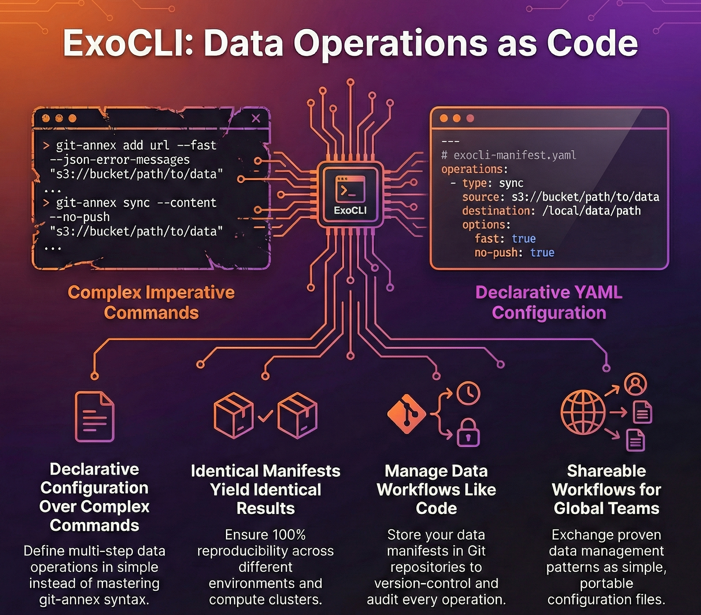
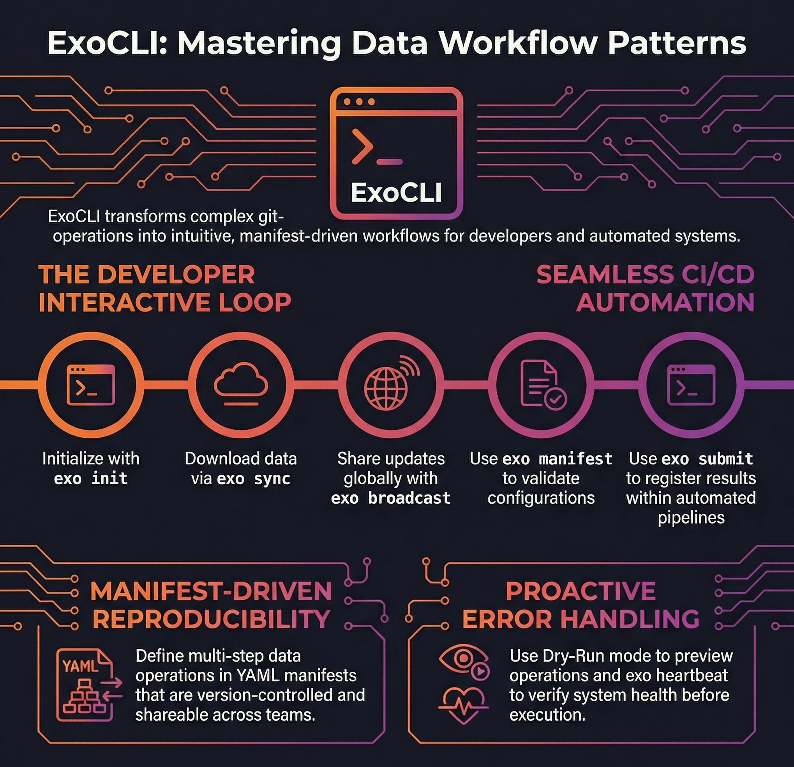

<p style="text-align: center !important; width: 100% !important; margin: 1rem auto !important;">
  
</p>

## 1. Defining ExoCLI and User Abstraction

ExoCLI serves as the primary command-line interface within the ExoHub ecosystem, designed to abstract the inherent complexity of [git-annex](https://git-annex.branchable.com/) and provide an accessible entry point for developers, data scientists, and automated systems. 

The source code is available at [https://github.com/genentech/exo-cli](https://github.com/genentech/exo-cli).


Instead of requiring users to master the extensive git-annex command set, ExoCLI provides intuitive, high-level commands that handle sophisticated data management workflows.

The interface introduces declarative YAML manifests, enabling complex, multi-step data operations to be defined, version-controlled, and executed repeatably. This approach transforms data management from imperative command sequences into declarative configurations, making workflows reproducible and shareable across teams.

ExoCLI bridges the gap between git-annex's powerful capabilities and user productivity, ensuring that the benefits of distributed data versioning remain accessible without requiring deep technical expertise in the underlying tools.


## 2. Role in the ExoHub Architecture

ExoCLI functions as the user-facing layer of the ExoHub data management stack, translating high-level user intentions into precise git-annex operations while coordinating with other ExoHub components for comprehensive data lifecycle management.

### Command Abstraction and Simplification

ExoCLI provides a comprehensive command set that maps complex git-annex operations to intuitive actions:

**Core Data Management:**
- **`exo sync`**: Synchronize git-annex content and record bad files
- **`exo copy`**: Copy annexed content between different storage remotes
- **`exo add`**: Add files to git-annex (direct pass-through to git-annex)
- **`exo export`**: Export annexed content for external consumption

**Metadata and Communication:**
- **`exo broadcast`**: Broadcast git-annex metadata across remotes
- **`exo submit`**: Submit manifests to the ExoHub API
- **`exo info`**: Show git-annex repository information and statistics

**Repository Management:**
- **`exo init`**: Initialize repository and configure remotes
- **`exo context`**: Manage git host configurations and authentication
- **`exo manifest`**: Validate and initialize ExoHub manifests

**Maintenance and Diagnostics:**
- **`exo fsck`**: Inspect annex logs and repair corrupted files
- **`exo link`**: Reconnect git-annex symlinks to external key stores
- **`exo mirror`**: Resolve annex keys and mirror content from S3
- **`exo heartbeat`**: Record and display system health metrics

Each command handles error management, progress reporting, and logging automatically, reducing the cognitive overhead for users.

### YAML Manifest-Driven Operations

ExoCLI introduces a declarative approach to data operations through YAML manifests:


```yaml
# pull-manifest.yaml
repository:
  url: "git@github.com:genentech/datasets/genomics-pipeline.git"
  version: "v2.1.0"
paths:
  - "raw-data/samples/*.fastq"
  - "processed/alignments"
remotes:
  primary: "s3-production"
  cache: "local-hpc"
```


This manifest-driven approach ensures that data operations are:
- **Reproducible**: Identical manifests produce identical results
- **Version-controlled**: Manifests can be stored alongside code in repositories
- **Shareable**: Teams can exchange proven data workflows as configuration files
- **Auditable**: Clear record of what data was accessed and when



## 3. Integration with ExoHub Components

ExoCLI serves as the orchestration interface that coordinates interactions between ExoHub's distributed components.

### ExoGit Integration

ExoCLI seamlessly interfaces with [ExoGit](/docs/components/exogit/) repositories, handling:
- **Authentication**: Automatic SSH key management and Git hosting platform authentication
- **Version Resolution**: Translation of semantic versions to specific Git commits and tags
- **Metadata Synchronization**: Bidirectional sync of repository metadata and git-annex information

### ExoWorkers Coordination

For large-scale operations, ExoCLI can delegate long-running tasks to ExoWorkers:
- **Background Processing**: Submit multi-terabyte transfers to resilient worker queues
- **Progress Monitoring**: Real-time status updates from distributed worker processes
- **Failure Recovery**: Automatic retry logic for interrupted data transfers


## 4. User Experience and Workflow Patterns

ExoCLI prioritizes developer experience through consistent interfaces and predictable behavior patterns.

### Interactive and Scripted Workflows

**Developer-Driven Data Management**: For interactive exploration and modification of datasets, ExoCLI provides immediate feedback and intuitive command structures. A typical workflow involves:

1. **Repository Setup**: Clone the dataset repository using standard `git clone` and run `exo init` to initialize git-annex
2. **Content Synchronization**: `exo sync` downloads actual data files from configured remotes
3. **Local Processing**: Work with data using existing tools and workflows
4. **Content Addition**: `exo add processed-results/` adds new files to git-annex
5. **Version Creation**: `git commit -m "feat: add processed analysis results"` commits the git-annex changes
6. **Metadata Distribution**: `exo broadcast` shares metadata updates across remotes

**Automated Integration**: ExoCLI commands integrate seamlessly into CI/CD pipelines, data processing workflows, and scheduled automation:

```bash
# CI/CD pipeline example
git clone $DATASET_REPO dataset
cd dataset
git checkout $VERSION_TAG
exo manifest .exo/production-manifest.yaml
exo sync
python process_data.py
exo add processed-results/
git commit -m "feat: add automated processing results"
exo export processed-results/ --to s3-production
exo submit .exo/production-manifest.yaml
```

### Error Handling and Diagnostics

ExoCLI provides comprehensive error reporting and diagnostic capabilities:
- **Dry-Run Mode**: Preview operations before execution to validate configurations
- **Verbose Logging**: Detailed operation logs for troubleshooting and auditing
- **Health Checks**: Built-in commands to verify system connectivity and configuration



## 5. Configuration and Extensibility

ExoCLI supports flexible configuration and extensibility to adapt to diverse organizational needs.

### Context-Based Configuration

ExoCLI uses a simple context system to manage git host and organization settings:

- **Contexts**: Named configurations that specify git host and organization details


- **Default Context**: When no context is configured, defaults to host `https://github.com/genentech/` with `sandbox` sub-path

- **Context Selection**: Use `exo context select <name>` to choose an active context
- **Runtime Override**: Use `--context <name>` flag to override the selected context for individual commands

### Extensibility

ExoCLI integrates with the broader ExoHub ecosystem through:
- **Manifest System**: YAML-based workflow definitions for repeatable operations
- **Context Management**: Flexible configuration for different git hosts and organizations
- **ExoHub API Integration**: Direct submission of manifests via `exo submit`
- **Git-annex Compatibility**: Full access to underlying git-annex capabilities

### Environment Integration

ExoCLI is designed as a command-line tool with specific platform requirements:
- **Platform Support**: Currently supports Linux, with macOS support in progress and Windows not yet supported
- **Dependency Requirements**: Built on git and git-annex, inheriting their system requirements and compatibility

## 6. Getting Started with ExoCLI

### Installation and Setup

ExoCLI can be installed with a single command that automatically handles all dependencies:

```bash
# Install ExoCLI and all dependencies

```

This installer automatically downloads and configures:
- **`exo`**: The main ExoCLI command-line interface
- **`git-annex`**: Core git-annex functionality for distributed data management
- **`s5cmd`**: High-performance S3 command-line tool
- **`git-annex-remote-s5cmd`**: Custom external special remote extension for optimized S3 operations

```bash
# Verify installation
exo version

# Check available commands
exo help

# View current context status
exo context show
```

### First Steps

Basic ExoCLI workflow for new users:


```bash
# Create and select a git host context
exo context create production --host https://github.com --org genentech
exo context select production

# Clone a dataset repository using standard git
git clone git@github.com:genentech/datasets/example-data.git
cd example-data

# Initialize git-annex in the repository
exo init

# Synchronize content from remotes
exo sync

# View repository information
exo info

# Check system health
exo heartbeat
```


### Learning Resources

- **Built-in Help**: `exo help <command>` provides detailed command documentation
- **Example Manifests**: Sample YAML configurations for common workflows
- **Integration Guides**: Step-by-step setup for different environments
- **Best Practices**: Recommendations for team adoption and workflow optimization

ExoCLI transforms complex distributed data management into an accessible, productive experience while maintaining the full power and flexibility of the underlying ExoHub architecture.
