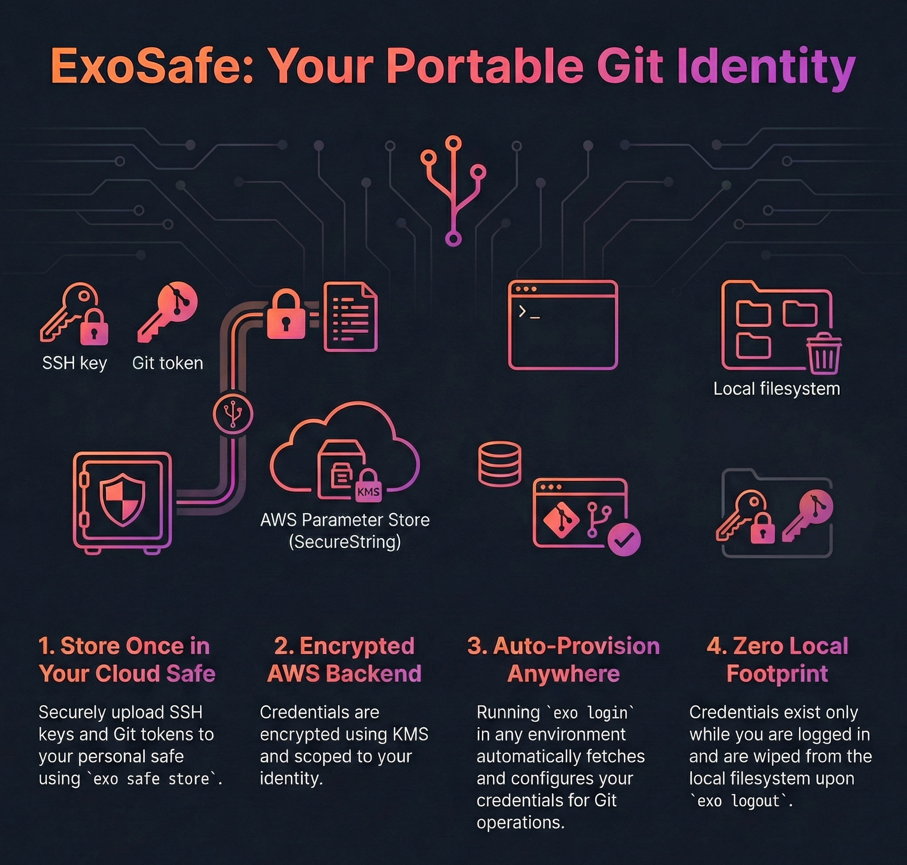
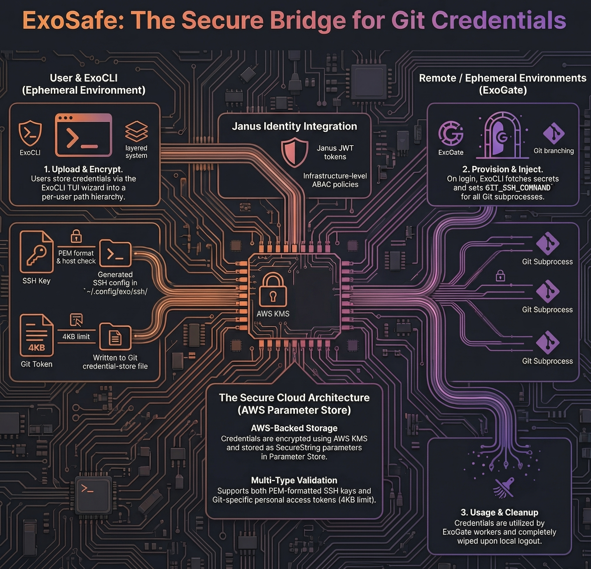

<p style="text-align: center !important; width: 100% !important; margin: 1rem auto !important;">
  
</p>

## 1. Defining ExoSafe and Its Purpose

ExoSafe is a credential management component within the ExoHub ecosystem, designed to securely store and provision SSH keys and git tokens for users operating in agentic, headless, or ephemeral environments. When users authenticate via  but lack locally available credentials — such as SSH keys needed for git clone/push operations — ExoSafe bridges that gap by providing a personal, cloud-backed safe.

The core problem ExoSafe solves is straightforward: in environments like MCP-connected AI agents, CI/CD pipelines, or remote compute nodes, a user can authenticate (obtaining JWT tokens and AWS credentials) but has no way to bring along their SSH keys or git tokens. ExoSafe allows users to upload these credentials once, and have them automatically provisioned whenever they run `exo login` in a new environment.



### Security Considerations

ExoSafe is designed for **git-access credentials only**. Users should follow these practices:

- **Use dedicated SSH keys** — Generate SSH keys specifically for git server access. Do not store SSH keys that are also used to access production servers, bastion hosts, or other infrastructure.
- **Prefer service accounts or deploy keys** — When possible, use generic identity / service account credentials rather than personal keys. This limits blast radius and simplifies rotation.
- **Use git-specific tokens** — Store tokens scoped to git operations (e.g., GitLab personal access tokens with `read_repository` / `write_repository` scope) rather than tokens with broad permissions.
- **Rotate regularly** — ExoSafe does not enforce TTL. Users are responsible for rotating stored credentials periodically and removing stale entries with `exo safe delete`.

## 2. Role in the ExoHub Architecture

ExoSafe operates as a bridge between  authentication and git operations, ensuring that authenticated users can seamlessly interact with git repositories regardless of their runtime environment.

### Integration with ExoHub Components

**ExoCLI**: [ExoCLI](/docs/components/exocli/) provides the `exo safe` command group for managing safe contents and automatically retrieves credentials during `exo login`. After provisioning, ExoCLI injects the SSH configuration into all git subprocesses it spawns.

**ExoGate**: [ExoGate](/docs/components/exogate/) coordinates data synchronization that often involves git operations. ExoSafe ensures the credentials needed for these operations are available in the environments where ExoGate's workers run.

** Authentication**: ExoSafe relies on  JWT tokens for identity resolution. The `preferred_username` claim determines which safe a user accesses. AWS session tags (user identity attributes) enable infrastructure-level access control via ABAC policies.

### Credential Flow

1. **Upload** — User stores credentials via `exo safe store` (interactive TUI wizard or direct flags; requires prior `exo login`)
2. **Storage** — Credentials are encrypted in AWS Parameter Store (SecureString) under `/exohub/safe/<username>/<type>/<key>`
3. **Retrieval** — On `exo login` (device flow only, not silent refresh), the CLI fetches safe contents via the ExoHub API
4. **Provisioning** — SSH keys are written to `~/.config/exo/ssh/` with a generated SSH config; git tokens are written to `~/.config/exo/credentials/git-credentials`
5. **Usage** — ExoCLI sets `GIT_SSH_COMMAND` on all git subprocesses, pointing to the generated SSH config
6. **Cleanup** — On `exo logout`, all provisioned credentials are removed from the local filesystem

## 3. Technical Implementation

### Typed Entries

Each safe entry has a required type that determines how it is validated on upload and provisioned on retrieval:

| Type | Upload validation | Provisioning |
|------|------------------|--------------|
| `ssh-key` | PEM format check + optional host verification | Written to `~/.config/exo/ssh/<name>`, SSH config generated |
| `token` | Size limit only (4KB) | Written to `git credential-store` file |

### Storage Backend

ExoSafe uses **AWS Systems Manager Parameter Store** (Standard tier, SecureString) as its backend:

- **Free** — Standard tier supports up to 10,000 parameters at no cost
- **Encrypted** — SecureString parameters are encrypted with AWS KMS
- **Tagged** — Each parameter is tagged with a user identity attribute (for ABAC) and `type` (for provisioning logic)
- **Size limit** — 4KB per parameter (sufficient for SSH keys and tokens)
- **Path hierarchy** — `/exohub/safe/<username>/<key-name>` provides natural per-user scoping

### SSH Configuration

When multiple SSH keys are stored (e.g., for different git providers), ExoSafe generates an SSH config file at `~/.config/exo/ssh/config`:


```
Host github.com
    IdentityFile ~/.config/exo/ssh/github.com
    StrictHostKeyChecking no
    IdentitiesOnly yes

Host github.com
    IdentityFile ~/.config/exo/ssh/github.com
    StrictHostKeyChecking no
    IdentitiesOnly yes
```


The `GIT_SSH_COMMAND` environment variable is set on each git subprocess to use this config, avoiding any modification to the user's global SSH or git configuration.

### CLI Usage

#### Interactive wizard

Run `exo safe store` with no arguments to launch a step-by-step TUI wizard. It guides you through selecting the credential type (SSH key or git token), choosing a host from a predefined list or entering a custom one, and selecting the credential source (key file picker or environment variable / paste). Press Escape at any step to go back.

```bash
exo safe store
```

#### Direct commands


```bash
# Store an SSH key (verifies against the host; prompts "Store anyway?" on failure)
exo safe store github.com --type ssh-key --file ~/.ssh/id_ed25519_git

# Store an SSH key, skip verification prompt
exo safe store github.com --type ssh-key --file ~/.ssh/id_ed25519_git --yes

# Store a git token from environment variable
exo safe store github.com --type token --from-env GITHUB_TOKEN

# Store a git token for github.com
exo safe store github.com --type token

# List stored credentials (names and types, no values)
exo safe list

# Show a credential value (interactive select if no name given)
exo safe show github.com

# Delete a credential (interactive select if no name given)
exo safe delete github.com

# Delete all credentials (shows warning, prompts for confirmation)
exo safe clear

# Export all credentials to a JSON file
exo safe dump ~/safe-backup.json

# Import credentials from a JSON dump
exo safe restore ~/safe-backup.json
```


### Storage path structure


Parameters are stored in AWS Parameter Store at `/exohub/safe/<username>/<type>/<key>`, where `<type>` is `ssh-key` or `token`. Including the type in the path allows storing both an SSH key and a git token for the same hostname. Names containing `:` (e.g., `github.com/genentech:30022`) are encoded as `_` in the path; the original name is preserved in a JSON envelope stored as the parameter value.


### API Endpoints

The ExoHub API provides CRUD operations for safe management:

| Method | Endpoint | Description |
|--------|----------|-------------|
| `GET` | `/api/safe` | Get all entries (names + types + values) |
| `GET` | `/api/safe/keys` | List entry names and types (no values) |
| `PUT` | `/api/safe/<key>` | Store or update a typed secret |
| `DELETE` | `/api/safe/<key>` | Delete a secret |

All endpoints require JWT authentication. The user's identity is resolved from the `preferred_username` claim.




## 4. FAQ

- **Shouldn't this part of the authentication provider, rather than ExoHub?**

Yes.

- **If I upload my ssh keys and some tokens, will you (ExoHub maintainer team) be able to see
  them?**

Yes.

- **What? Can I encrypt my secrets?**

No.

- **Can I trust you, though?**

Yes.

- **But... this is not fully secure, I think the idea is cool but that "safe" should be provided by
 itself, with dedicated custom KMS keys per user**

I agree.

- **What can I do to help?**


Request this feature by opening an issue on the project repository.

