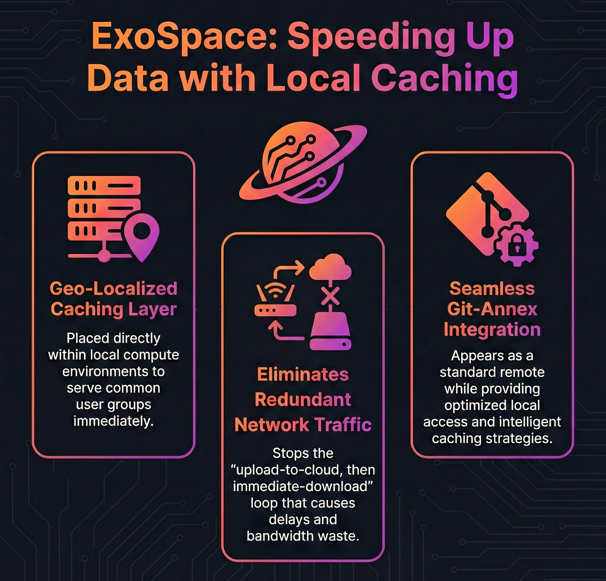
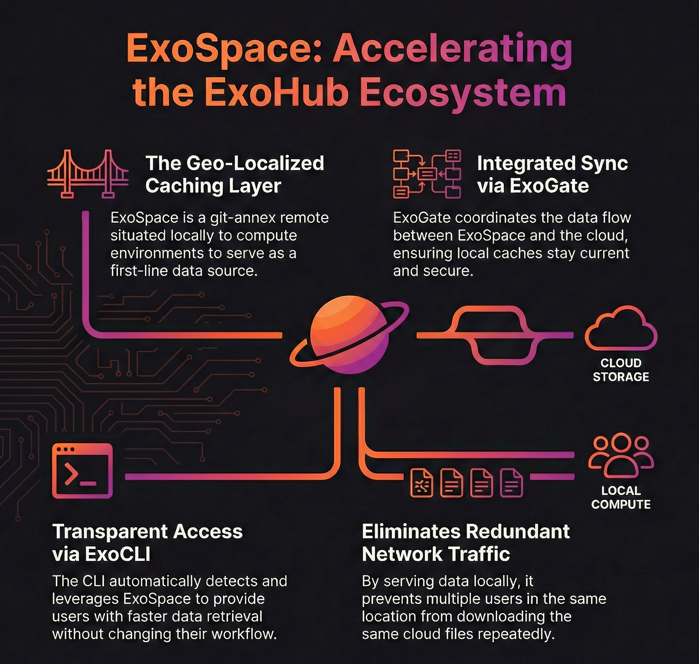

  

## 1. Defining ExoSpace and Geo-Localized Caching

ExoSpace serves as a specialized [git-annex](https://git-annex.branchable.com/) remote within the ExoHub ecosystem, designed to function as a geo-localized caching layer for distributed data management. Rather than being a centralized storage solution, ExoSpace operates as a first-line caching area situated locally to specific compute environments where datasets are created and accessed by common user groups.

The fundamental principle behind ExoSpace is reducing unnecessary data transfer between on-premises and cloud environments. In traditional architectures, when a user uploads a dataset to cloud storage, another user in the same physical location often needs to download that same dataset immediately, creating redundant network traffic and delays. ExoSpace eliminates this inefficiency by providing local caching that serves as the primary data source for nearby compute resources.

ExoSpace integrates seamlessly with git-annex's distributed architecture, appearing as a standard git-annex remote while providing optimized local access patterns and intelligent caching strategies.

## 2. Role in the ExoHub Architecture

ExoSpace functions as the bridge between local compute environments and the broader ExoHub distributed data ecosystem, optimizing data access patterns while maintaining full integration with version control and metadata management systems.

### Local-First Data Access

ExoSpace prioritizes local data availability, serving as the primary source for git-annex content retrieval:

- **Hot Data Serving**: Frequently accessed datasets remain locally available without cloud round-trips
- **Compute Affinity**: Data placement follows compute resource location for optimal access times
- **Bandwidth Optimization**: Reduces external network usage by serving local copies
- **Latency Reduction**: Eliminates cloud storage latency for locally cached content

### Integration with ExoHub Components

ExoSpace operates in coordination with other ExoHub components to provide comprehensive data management:

**ExoGate Orchestration**: [ExoGate](/docs/components/exogate/) coordinates data synchronization between ExoSpace instances and cloud storage, ensuring that local caches remain current while respecting network and security constraints.

**ExoCLI Operations**: [ExoCLI](/docs/components/exocli/) helps with setting up ExoSpace remotes and automatically leverages them when available, transparently providing faster data access through local caching without requiring changes to user workflows.

## 3. Technical Implementation

ExoSpace is implemented as a rsync type remote that provides local storage with intelligent caching capabilities and integration hooks for the broader ExoHub ecosystem.

### Built-in Remote Type

ExoSpace leverages git-annex's built-in rsync remote type, providing standard git-annex functionality with full compatibility for `git-annex copy`, `git-annex get`, `git-annex drop`, and other data management commands.

### Caching Strategies

While ExoSpace currently functions as a standard rsync remote for local storage, its design opens opportunities for implementing intelligent caching strategies:

**Demand Caching**: Potential to automatically cache data when first accessed locally, keeping frequently used datasets immediately available.

**Preemptive Caching**: Future capability to proactively fetch datasets based on predicted usage patterns, team workflows, or scheduled processes.

**Capacity Management**: Opportunity to implement LRU (Least Recently Used) eviction policies to manage local storage capacity while retaining hot data.

**Collaboration Awareness**: Potential to prioritize caching of datasets likely to be accessed by multiple users in the same location.

### Storage Backend Flexibility

ExoSpace supports multiple local storage backends:

- **Local Filesystems**: Direct storage on local disk arrays, NFS mounts, or shared filesystems
- **HPC Integration**: Integration with high-performance computing storage systems and parallel filesystems
- **Container Storage**: Support for containerized environments with persistent volume claims

ExoSpace transforms distributed data access by bringing intelligence and locality to data caching, enabling teams to work efficiently with large datasets while minimizing network overhead and access latency.
