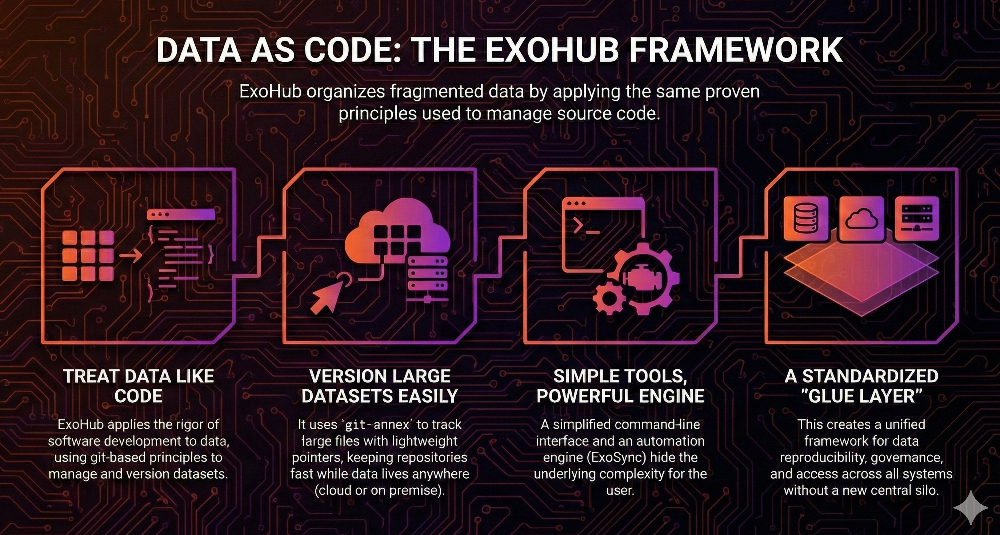
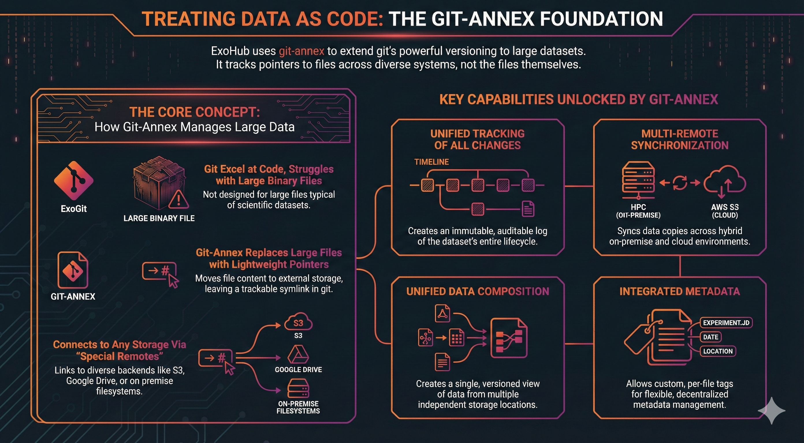
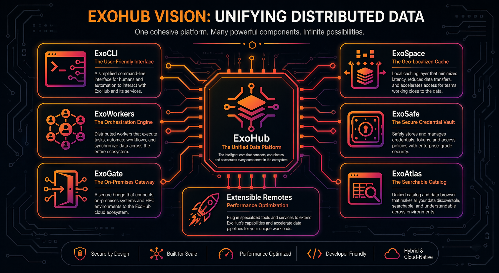
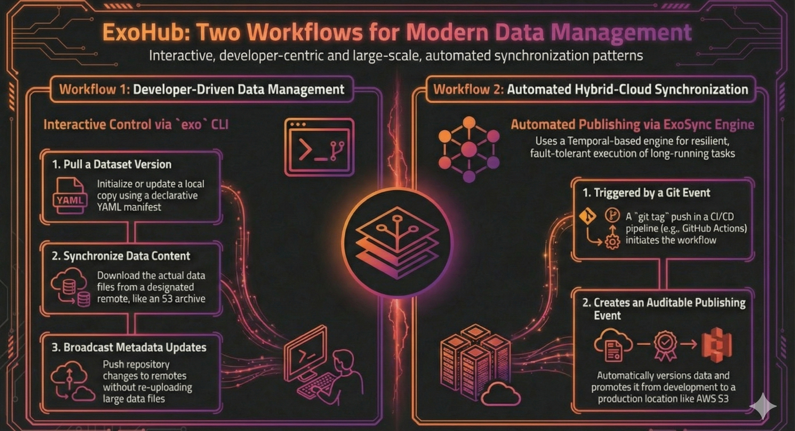
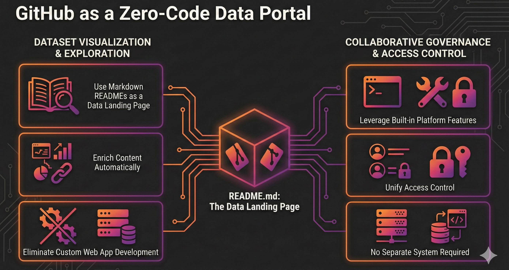
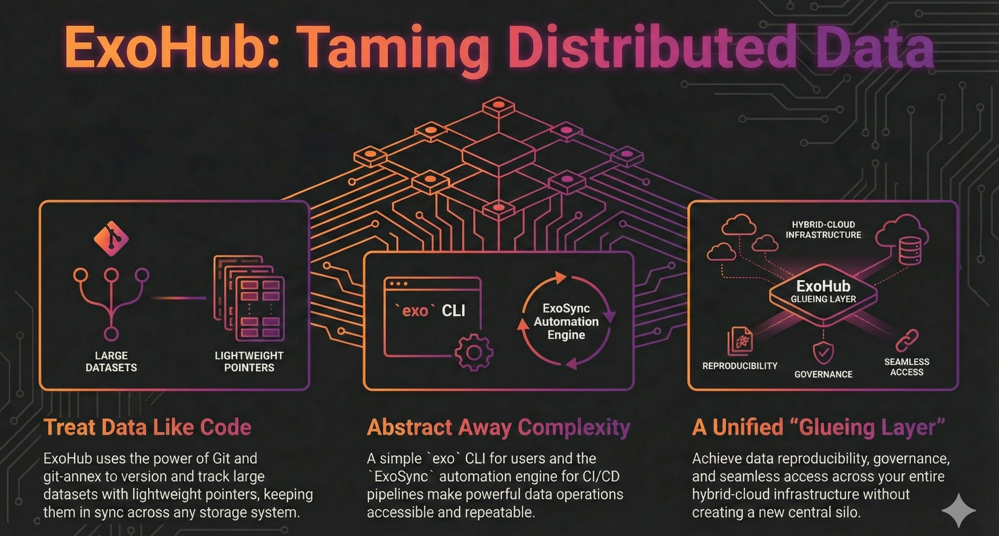

### Executive Summary

**ExoHub** is a technical framework designed to resolve the fragmentation and synchronization issues
inherent in modern, distributed data environments by treating data with the same rigor as source
code. The architecture utilizes git-annex as a foundational layer, allowing large datasets to be
versioned and tracked via lightweight pointers while the actual files remain stored across diverse
backends like cloud object stores and on-premises high-performance computing systems. To overcome the
steep learning curve of its underlying tools, the system introduces an abstraction layer consisting
of a simplified command-line interface and a resilient orchestration engine called ExoWorkers for
automating complex workflows. Ultimately, the project serves as a standardized gluing layer that
ensures data reproducibility, governance, and seamless access across hybrid-cloud infrastructures
without requiring a new centralized silo.

## 1. The Challenge of Modern Data Ecosystems

Modern data management is defined by the complexity of hybrid environments, where data assets are
distributed across a mix of on-premises high-performance computing (HPC) filesystems, cloud object
stores, and collaborative platforms. This operational reality presents significant architectural
challenges that manifest as data fragmentation, desynchronization, and the proliferation of
disconnected catalogs. This section will diagnose the root causes of these issues, establishing the
critical need for a new architectural approach to bring order to this inherent chaos.

The symptoms of a fragmented data landscape are familiar to most data-driven organizations. These
challenges do not arise from a flawed strategy but from the natural, agile way teams work, adopting
tools and storage solutions that best fit their immediate needs. The fragmentation itself is not
inherently problematic; the core issue stems from the lack of a formal monitoring and tracking layer
to manage data as it moves and evolves across these disparate locations. This leads to systemic
issues:

- **Unsynchronized Duplication**:  Data is frequently copied to different locations for convenience
  or performance, but these copies quickly fall out of sync. Without a formal tracking mechanism, it
  becomes impossible to determine which version is the canonical source of truth.
- **Access Complexity**:  Data is spread across a heterogeneous collection of storage backends,
  including cloud services like AWS S3 and Google Drive, as well as on-premises sHPC filesystems.
  Accessing this data requires navigating a maze of different clients, credentials, and network
  pathways.
- **Catalog Desynchronization**:  In an attempt to track data, organizations build catalogs.
  However, when a catalog describes data residing in a location not under its direct control, it
  creates a significant risk of desynchronization. The data can change, rendering the catalog's
  metadata outdated, irrelevant, or dangerously incorrect.

This messy situation, characterized by disconnected communication channels and untracked data forks,
makes governance, reproducibility, and collaboration nearly impossible. The core philosophical stance
of the ExoHub project is that the solution does not lie in building another centralized system.
Instead, the answer is to create a standardized, extensible gluing layer built upon proven,
universally adopted standards. This approach provides a common framework for tracking,
synchronizing, and managing data, regardless of where it lives.

## 2. Foundational Principles: Treating Data as Code with git-annex

The strategic foundation of ExoHub is the adoption of proven software engineering principles for
data management. For decades, the problem of managing, versioning, and collaborating on complex
digital assets has been elegantly solved for source code. The core concept is to treat data with the
same rigor as code, and git has emerged as the ubiquitous, undisputed standard for this paradigm. By
leveraging git, we can build upon a tool that is already a daily fixture for nearly every technical
professional.

While git excels at tracking text-based source code, it is not designed to handle the large binary
files typical of scientific datasets. The technical rationale for choosing git-annex as ExoHub's
foundational technology is that it directly solves this limitation without sacrificing the
distributed power of git. git-annex works by "annexing" large files: it moves the file content to an
external storage location and replaces it in the git repository with a lightweight pointer (a
symlink). This pointer is then tracked by git, allowing the full history of the data to be versioned
without bloating the repository itself, using a powerful concept of "special remotes" to connect to
to a diverse array of storage backends, from cloud object stores like S3 and Google Drive to on-premises
filesystems.

The git-annex approach provides a rich set of features that form the bedrock of the ExoHub
architecture.

- **Unified Tracking**:  Every change to the dataset—from modifying a single data file to updating
  metadata tags—is tracked in the git history. This provides an immutable, auditable log of the
  dataset's entire lifecycle, capturing not just major releases but any tiny change worth tracking.
- **Multi-Remote Synchronization**:  git-annex is designed for a distributed world. It allows
  multiple remotes to be configured for a single repository, enabling robust synchronization of data
  copies across hybrid on-prem (sHPC) and cloud (AWS S3) environments. This capability is essential
  for creating geolocated caches and ensuring data consistency across disparate storage systems.
- **Data Composition**:  Assembling datasets from files stored in different locations is a common
  challenge. git-annex formalizes this process by allowing a single project to track pointers to
  data residing in multiple, independent storage backends, creating a unified and version-controlled
  view of a composite dataset.
- **Integrated Metadata**:  Beyond the rich metadata inherently captured by git (author, timestamp,
  commit hash), git-annex allows for custom, per-file tags. This simple key-value system provides a
  flexible, decentralized way to embed technical metadata directly with the data it describes, which
  can be used to drive synchronization rules or feed a higher-level data catalog.
- **External System Integration**: Through the “external special remote” protocol, git-annex enables
  the implementation of custom remotes, providing a robust integration layer to normalize access and
  connect the architecture with diverse internal and legacy systems.
- **Workflow Automation**:  Because git-annex is fully integrated with git, it can leverage the
  entire git ecosystem for automation. Git hooks (e.g., pre-commit) can enforce data governance
  rules, and structured commit messages (like conventional commits) can be used to automate data
  versioning and record formal provenance information.

In summary, git-annex provides the powerful, distributed, and extensible foundation required for the
ExoHub architecture. However, its comprehensive feature set comes with a steep learning curve. This
complexity necessitates a carefully designed abstraction layer to make its power accessible to a
broader audience. The following section details the ExoHub components that provide this crucial
abstraction.

## 3. The ExoHub Architecture: A Component-Based Overview

**ExoHub** is the architectural implementation of the "data as code" philosophy, designed to serve
as a user-friendly and robust orchestration layer on top of the powerful git-annex foundation. The
system is not a monolithic application but a collection of cohesive components that work in concert
to abstract complexity and automate sophisticated data management workflows. This section dissects
the core components of the ExoHub architecture, explaining how they provide a unified interface for
managing distributed data.

The high-level system architecture enables the creation of a logical project that serves as a
single, version-controlled entry point to data that may be physically scattered across the
enterprise. This unified view can compose data, tags, and metadata from disparate storage locations,
including multiple AWS S3 buckets, Google Drive, public HTTP servers, and on-premises sHPC
filesystems.

The system is composed of several primary components, each with a distinct role:

- 
  **`exo`  CLI**:  This command-line interface is the primary entry point for developers, data
  scientists, and automated agents. Its fundamental purpose is to abstract the inherent complexity
  of git-annex. Instead of requiring users to learn the extensive git-annex command set, the exo CLI
  provides simple, high-level commands such as pull, export, copy, sync, and broadcast. It
  introduces the use of declarative YAML manifests, allowing complex, multi-step data operations to
  be defined, version-controlled, and executed in a repeatable manner. Additional specialized
  commands exist to support the orchestrated workflows detailed in Section 4.0.
-  **ExoWorkers**:  This is the system's resilient orchestration engine. Implemented as a Temporal
  Worker, ExoWorkers are responsible for executing long-running, fault-tolerant data workflows. It
  automates tasks like synchronizing large datasets between on-premises and cloud environments or
  mirroring data for local processing. By leveraging Temporal, ExoWorkers ensure that these critical
  data operations are durable and can recover from transient failures, which is essential in a
  hybrid-cloud environment.
-  **ExoGate**:  This component serves as the on-premises gateway, bridging the gap between cloud-based
  infrastructure and protected local resources. ExoGate runs on-premises and allows cloud-native
  ExoWorkers to securely interact with high-performance filesystems like sHPC HPFS. This
  component directly solves the "Access Complexity" problem identified earlier by creating a secure,
  automated bridge for cloud-based orchestration to interact with on-premises data, eliminating the
  need for users to navigate complex network pathways and credentials for sHPC filesystems.
-  **ExoSpace**: This git-annex remote acts as a first-line caching area, situated locally to the
  specific compute environments (e.g., sHPC) where datasets are created and accessed by a common set
  of users. It serves as the local source of annexed data for cloud synchronization, which ExoGate
  orchestrates via ExoWorkers. Crucially, it functions as a geo-localized cache, preventing excessive
  upload/download traffic between on-premises and cloud, which would otherwise occur when a user
  uploads a new dataset only for another user in the same location to immediately download it. It
  can also be used in preemptive caching scenarios to accelerate data access.
-  **ExoSafe**: This component provides a cloud-backed vault for the git credentials that users and
  automated systems need in ephemeral environments. By storing SSH keys and tokens in a typed,
  centrally managed store and provisioning them during login, ExoSafe removes a major source of
  friction in hybrid workflows while preserving secure, auditable access to repositories.
-  **ExoAtlas**: This component is the discovery and browsing layer for published datasets and
  artifacts. It gives users a searchable catalog experience, available both as the interactive
  `exo atlas` terminal interface and as a browser-based web application, making distributed data
  assets easier to find, inspect, and retrieve across environments.
- **Extensible Remotes**:  The architecture is designed for extensibility. Key examples include the
  custom git-annex-remote-s5cmd, a special remote written in Go that integrates the high-performance
  s5cmd tool for parallelized S3 transfers, and the `artifactdb` remote type, which publishes the
  generic and technical metadata produced by `exo bundle` into the multi-tenant ArtifactDB 
  catalog. Together, these integrations demonstrate the system's ability to incorporate specialized,
  best-of-breed tools to optimize performance and metadata publication for specific backends.

Together, these components form a synergistic system that simplifies and automates distributed data
management. The exo CLI provides an accessible interface for users, while ExoWorkers, ExoGate,
ExoSpace, ExoSafe, ExoAtlas, and extensible remotes provide the robust backend and access layers
for orchestrating complex workflows. The
following section will demonstrate how these components are utilized in practical, end-to-end
scenarios.

## 4. Core System Workflows in Action

The true power of the ExoHub architecture is realized through its operational workflows, which
translate its foundational principles into practical, repeatable data management patterns. These
workflows cater to two primary modes of operation: an interactive, CLI-driven mode for developers
and data scientists working on local machines, and an automated, orchestrated mode for large-scale,
CI/CD-integrated data synchronization.

### Workflow 1: Developer-Driven Data Management (exo CLI)

For users who need to interactively explore, modify, and version datasets, the exo CLI provides a
streamlined and powerful interface. A typical workflow involves using simple commands in conjunction
with declarative YAML manifests to ensure operations are repeatable and version-controlled. A
developer wanting to refresh a local dataset, sync it with an S3 remote, and then broadcast the
metadata changes would follow these steps:

- **Pull a specific version of the dataset**.  Using a manifest that defines the repository URL and
  the target version tag, the developer initializes or updates their local copy.
- **Synchronize data content**.  The developer then uses a sync manifest to download the actual data
  files for specific paths from a designated git-annex remote, such as an S3 archive. The manifest
  allows for precise control over which parts of the dataset are materialized locally.
- **Broadcast metadata updates**.  After making local changes and committing them, the developer can
  update other remotes with the latest metadata (the state of the git repository) without
  transferring any large data files. This manifest-driven approach ensures that even complex data
  wrangling tasks are documented as code, can be shared among team members, and are easily
  integrated into larger scripts.

### Workflow 2: Automated Hybrid-Cloud Synchronization (ExoSync & Temporal)

For large-scale, automated data publishing and replication, ExoHub relies on ExoSync, its
Temporal-based orchestration engine. This workflow is designed for integration into CI/CD pipelines
and provides resilient, fault-tolerant execution of long-running data transfers.

- **ExoSyncWorkflow**: This is the primary workflow for publishing and replicating datasets between
  different storage environments. A common use case is a CI/CD pipeline triggered by a git event.
  For example, a git tag push to a repository can trigger a GitHub Action. This action, in turn,
  invokes the ExoSyncWorkflow, which annexes the newly tagged data and synchronizes it to a
  production AWS S3 bucket. This pattern creates a fully automated, auditable "data publishing"
  event, where a versioned dataset is promoted from development to a production location.
- **ExoExportWorkflow**: If the data stored on S3 needs to be accessed by third-party downstream
  consumers (e.g., direct S3 access), the ExoExportWorkflow replicates a tree on a
  filesystem to S3, similarly to what `aws s3 sync` would produce. The full history and versions of
  the assets are lost in favor of an easy-to-access snapshot of the data, equivalent to a release
  extract from the git repository.

## 5. GitHub as a Data Portal

A key consideration for the **ExoHub Portal** is avoiding the cost and complexity of custom web
application development for basic data exploration. By leveraging the universal adoption of
**GitHub/GitLab** and **Markdown-based READMEs**, ExoHub can provide an efficient, zero-maintenance solution
for **basic dataset visualization** and overview. A well-constructed README, enriched with automatically
generated tables and static visualizations, links, screenshots, badges, can serve as the primary
landing page for a dataset. Furthermore, the git hosting platform itself, such as **GitHub**, already
provides robust, built-in features for **collaborative data governance** and **access control**, allowing
administrators to manage user and team permissions directly against the versioned data repository
without needing a separate system.

## 6. Implementation Considerations and Scalability

While the ExoHub architecture provides a powerful solution for distributed data management, any
robust system design involves trade-offs and practical challenges. A transparent analysis of these
considerations is essential for successful implementation. This section provides a balanced overview
of potential hurdles related to usability, performance at scale, and dependencies, along with the
mitigating strategies employed by the ExoHub architecture.

- **`git-annex` Complexity**:  The single greatest risk is the steep learning curve of the
  underlying git-annex technology. Its feature-rich nature makes it complex for newcomers.
    - _Mitigation_:  ExoHub addresses this directly by abstracting all common user interactions
      through the simplified exo CLI and fully orchestrated Temporal workflows. End-users are
      intentionally shielded from git-annex internals, allowing them to benefit from its power
      without needing to master its complexity.
- **Scalability**:  Managing extremely large datasets raises valid performance questions,
  particularly around the time required to hash large files and the limits of git hosting platforms.
    - _Mitigation_:  Real-world examples from similar systems like Datalad demonstrate the viability
      of this approach at scale, with documented use cases of datasets up to 500TB containing
      millions of files. While git hosting platforms can have repository limits, this is a
      manageable constraint; repositories can be hosted on-premises or even stored as bundles in
      object storage, as a central git server is not strictly required.
- **Authentication**:  A distributed system that connects to multiple, heterogeneous remotes (AWS
  S3, Google Drive, git servers) introduces the "authenticating thunder" problem, where users or
  systems must manage a complex web of credentials.
    - _Mitigation_:  While a comprehensive solution remains a challenge, services like  provide
      a normalization layer for accessing AWS resources, simplifying credential management for a
      significant portion of the cloud ecosystem.
- **Toolchain Dependencies**:  git-annex is written in Haskell, which is not a common enterprise
  language and can present a deployment challenge.
    - _Mitigation_:  This dependency is managed by controlling the toolchain and compiling git-annex
      into static binaries. This approach, also used by projects like Datalad, ensures that the tool
      can be deployed reliably across different platforms (e.g., in Docker containers or on sHPC
      systems) without requiring a complex runtime environment.

These challenges are acknowledged as real but are ultimately positioned as manageable engineering
problems. Through thoughtful architectural design—specifically the use of abstraction layers,
workflow orchestration, and controlled dependencies—ExoHub effectively mitigates these risks to
deliver a scalable and usable system.

## 7. Conclusion: A Gluing Layer for Decentralized Data

ExoHub presents a paradigm shift into “treating data like code” by applying industry-standard,
git-based workflows and principles. It provides a robust, flexible, and extensible **gluing
layer** designed to bring coherence to the inherently distributed and fragmented nature of modern
data ecosystems. Combining the universal principles of git, the distributed power of git-annex, and
the resilience of modern workflow orchestration with Temporal, ExoHub offers a pragmatic and
powerful solution to today's data management challenges.

The architecture directly addresses the core problems of data fragmentation and desynchronization
outlined at the start. Unsynchronized data copies are replaced with version-controlled, tracked
remotes. Complex, multi-platform access is unified through a single, abstracted interface. The risk
of stale metadata in disconnected catalogs is eliminated by embedding metadata with the data itself,
managed under a single, auditable version history.

Ultimately, ExoHub champions the philosophy of treating data with the same rigor and proven tooling
as source code. This approach establishes a foundation for a more agile, traceable, and
decentralized data ecosystem, empowering organizations to manage complexity not by fighting it with
yet another silo, but by embracing it with a common, standardized framework built for a distributed
world.

